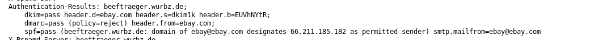
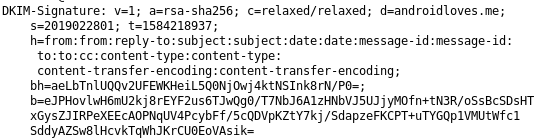

# Verifying a DKIM-Signature by hand

tldr: We take an email and verify the DKIM-Signature step by step using python. We also take care about the signing itself (RSA). The RSA part takes more place than orignally planed. The whole source code can be found in [verify-dkim.py](verify-dkim.py).  

I recently had an issue with my DKIM signatures. I just got a 'Signature wrong' message and couldn't find out what the problem was. So I decided to take a look into.

What is DKIM?
If your mail server supports DKIM (Domain Keys Identified Mail), it signs the email headers and body. So you can be sure that the message was not modified.

# High level perspective - How does it work?
1) Alice writes an email to Bob (e.g. with Thunderbird). No magic is happening here
2) The email goes to the mail server Alice has configured in her mail client
3) The mail server does the DKIM magic: It signs the email of Alice (e.g. with RSA) and adds a DKIM-Signature header to the email
4) The mail server forwards the message to Bob's mail server
5) Bob's mail server verifies the DKIM-Signature. Therefore it needs the public key of Alice which is stored in a DNS record

If you are using Thunderbird you can install `DKIM Verifier` to see if the DKIM signature is valid  
  

You can use [DMARC](https://en.wikipedia.org/wiki/DMARC) to specify what a mail server should do if a DKIM signature is wrong.
  

This is what a DKIM-Signature looks like:  
  

The values are explained in [RFC6376](https://tools.ietf.org/html/rfc6376#section-3.5)  


| key=value        | description           | 
| ------------- |:-------------:| 
| `v=1` | there is only version 1 right now as far as I know   |  
| `a=rsa-sha256` | alogrithms used for hashing (sha256) and signing (RSA)   |  
| `c=relaxed/relaxed`| message canonicalization (how is the message prepared before signing?). Values can be simple or relaxed. Specified in [RFC6376 Section 3.4](https://tools.ietf.org/html/rfc6376#section-3.4)  |  
| `d=androidloves.me` | domain for the DNS lookup to get the public key |  
| `s=2019022801`  | selector for the public key. In bigger setups it makes sense to use different ones  |  
| `t=1584218937`  | signature timestamp  |  
| `h=from:from:reply-to:subject:subject:date:date:message-id:message-id:to:to:cc:content-type:content-type:content-transfer-encoding:content-transfer-encoding;` | signed headers field (headers that are signed, separated by a colon)   |  
| `bh=aeLbTnlUQQv2UFEWKHeiL5Q0NjOwj4ktNSInk8rN/P0=` | body hash: hash of the canonicalized body. The hash function specified in 'a' is used|  
| `b=eJPHovlwH6mU2kj8 ... SddyAZSw8lHcvkTqWhJKrCU0EoVAsik=`  |  base64 encoded signature  |  
     

If we (as as mail server) receive an email and want to verify whether the email was forged, we first need to get the public key. Therefore we use the s and d paramter out of the DKIM-Signature to construct a DNS request (format is {s}._domainkey.{d} and type TXT)

```
kmille@linbox ~% dig 2019022801._domainkey.androidloves.me txt +short  
"v=DKIM1; k=rsa; p=MIGfMA0GCSqGSIb3DQEBAQUAA4GNADCBiQKBgQCcaywJn59dbp7TbRiDsVloBdCsgl9wAEvHo9WCDSNRqDJjkF1Fjy44Q4emckHP/Tv7hJdIlBtV8hEw5zGD+/kKkhnlx04BSYqXuxed1nOq6FDjNTIR6TmHetMfVU1IcO7ewyJZp5/2uM64JmTDh2u3ed4+JR7jqFE2e/ZqBTM1iQIDAQAB"
```

The response is self-explanatory: p is the base64 encoded public key. The steps to verify the signature are the fofllowing:  
1) calculate the hash of the body
2) compare the calculated hash with the bh value from the DKIM-Signature header of the email
3) construct `hashed_header` (the message which is signed) based on parameter h of the DKIM-Signature header
4) verify the signature

# Let's dig into the details
In Thunderbird you can save emails as a file (File -> Save as). I saved my email as email.eml. Here it is:

```Return-Path: <christian.schneider@androidloves.me>
Delivered-To: mail@kmille.wtf
Received: from beeftraeger.wurbz.de
	by beeftraeger.wurbz.de (Dovecot) with LMTP id Pp35GDlDbV4/EAAAXgB5vA
	for <mail@kmille.wtf>; Sat, 14 Mar 2020 21:48:57 +0100
To: mail@kmille.wtf
DKIM-Signature: v=1; a=rsa-sha256; c=relaxed/relaxed; d=androidloves.me;
	s=2019022801; t=1584218937;
	h=from:from:reply-to:subject:subject:date:date:message-id:message-id:
	 to:to:cc:content-type:content-type:
	 content-transfer-encoding:content-transfer-encoding;
	bh=aeLbTnlUQQv2UFEWKHeiL5Q0NjOwj4ktNSInk8rN/P0=;
	b=eJPHovlwH6mU2kj8rEYF2us6TJwQg0/T7NbJ6A1zHNbVJ5UJjyMOfn+tN3R/oSsBcSDsHT
	xGysZJIRPeXEEcAOPNqUV4PcybFf/5cQDVpKZtY7kj/SdapzeFKCPT+uTYGQp1VMUtWfc1
	SddyAZSw8lHcvkTqWhJKrCU0EoVAsik=
From: Christian Schneider <christian.schneider@androidloves.me>
Subject: this is a test mail
Message-ID: <4c2828df-2dae-74ff-2fa7-e6ac36100341@androidloves.me>
Date: Sat, 14 Mar 2020 21:48:57 +0100
Content-Type: text/plain; charset=utf-8; format=flowed
Content-Transfer-Encoding: 7bit
Content-Language: en-US-large
Authentication-Results: beeftraeger.wurbz.de;
	auth=pass smtp.auth=christian.schneider@androidloves.me smtp.mailfrom=christian.schneider@androidloves.me


test test
```


Let's take a look into the code.
    
```python
    mail = email.message_from_bytes(open("email.eml", "rb").read())
    dkim_header = mail.get("DKIM-Signature")

    dkim_parameter = parse_dkim_header(dkim_header)
```

We open the email and make an email object out of it. `dkim_header` is the DKIM-Signature header of the email. `dkim_parameter` is DKIM-Signature header converted to a dictionary.  

```
(Pdb++) dkim_header   
'v=1; a=rsa-sha256; c=relaxed/relaxed; d=androidloves.me;\n\ts=2019022801; t=1584218937;\n\th=from:from:reply-to:subject:subject:date:date:message-id:message-id:\n\t to:to:cc:content-type:content-type:\n\t content-transfer-encoding:content-transfer-encoding;\n\tbh=aeLbTnlUQQv2UFEWKHeiL5Q0NjOwj4ktNSInk8rN/P0=;\n\tb=eJPHovlwH6mU2kj8rEYF2us6TJwQg0/T7NbJ6A1zHNbVJ5UJjyMOfn+tN3R/oSsBcSDsHT\n\txGysZJIRPeXEEcAOPNqUV4PcybFf/5cQDVpKZtY7kj/SdapzeFKCPT+uTYGQp1VMUtWfc1\n\tSddyAZSw8lHcvkTqWhJKrCU0EoVAsik=' >   
(Pdb++) dkim_parameter  
{'v': '1', 'a': 'rsa-sha256', 'c': 'relaxed/relaxed', 'd': 'androidloves.me', 's': '2019022801', 't': '1584218937', 'h': 'from:from:reply-to:subject:subject:date:date:message-id:message-id:to:to:cc:content-type:content-type:content-transfer-encoding:content-transfer-encoding', 'bh': 'aeLbTnlUQQv2UFEWKHeiL5Q0NjOwj4ktNSInk8rN/P0=', 'b': 'eJPHovlwH6mU2kj8rEYF2us6TJwQg0/T7NbJ6A1zHNbVJ5UJjyMOfn+tN3R/oSsBcSDsHTxGysZJIRPeXEEcAOPNqUV4PcybFf/5cQDVpKZtY7kj/SdapzeFKCPT+uTYGQp1VMUtWfc1SddyAZSw8lHcvkTqWhJKrCU0EoVAsik='}  
```


Before we can calculate the body hash the body needs to be canonicalized. This is specified in [Section 3.4.4](https://tools.ietf.org/html/rfc6376#section-3.4.4) and depends on the c parameter of the DKIM-Signature header (simple/relaxed). My code is not RFC compliant. What we implement is `Ignore all whitespace at the end of lines`. What's missing here is for example `Reduce all sequences of WSP within a line to a single SP character` (not needed here). The body hash is the base64 encoded SHA256 hash of the canonicalized body.

```python
def hash_body(body: str) -> str:
    canonicalized_body = body.strip().encode() + b"\r\n"
    bh = b64encode(SHA256.new(canonicalized_body).digest())
    return bh.decode()
    
    
    body = mail.get_payload()
    body_hash = hash_body(body)
    
    assert body_hash == dkim_parameter['bh']


```

```
(Pdb++) body  
'test test\n\n\n'  
(Pdb++) body_hash  
'aeLbTnlUQQv2UFEWKHeiL5Q0NjOwj4ktNSInk8rN/P0='  
```


The body hash we calculated matches the body hash supplied in the DKIM-Signature (bh). Now let's get the public key.


```python

defk get_public_key(domain: str, selector: str) -> RSA.RsaKey:
    dns_response = dns.resolver.query("{}._domainkey.{}.".format(selector, domain), "TXT").response.answer[0].to_text()
    p = re.search(r'p=([\w\d/+]*)', dns_response).group(1)
    pub_key = RSA.importKey(b64decode(p))
    return pub_key
    
public_key = get_public_key(dkim_parameter['d'], dkim_parameter['s'])

```

```
(Pdb++) public_key.n  
109840904909940404959744221876858620709969218326506407082221779394032326489812790786649034812718574099046117725854400828455845069780702401414898758049907995661494814186559221483509803472525659208951140463116595200877740816407104014421586827141402457631883375757223612729692148186236929622346251839432830432649  
(Pdb++) public_key.e  
65537  
```

To verify the signature we need to know how RSA works. A good explanation can you find [here](http://sergematovic.tripod.com/rsa1.html). RSA is a public key cryptosystem. The public key contains e and n (as you can see above). The private key contains d and n (e stands for encrypt, d stands for decrypt).  

To encrypt some plain text, calculate: ciphertext = plaintext ^ e mod n (^ means plaintext to the power of e)  
To decrypt the ciphertext, calculate: plaintext = ciphertext ^ d mod n  

We can use RSA for signing a message/verifiy a signature by just swapping e and d:  
To sign a message, calculate: signature = message ^ d mod n   
To verify a signature, calculate: signature ^ e mod d and compare the message with the message you expect  

In a nutshell: with the private key (d,n) you can decrypt and sign messages. With the public key (e,n) you can verify signatures and encrypt messages. In our DKIM use case the private key lies on the mail server, the public key is stored in a DNS record. 

One little thing: RSA only works with numbers. But our email consists of text!? We first have to convert it into a big number. `verify-dkim.py` uses the functions `long_to_bytes` and `long_to_bytes` of `Crypto.Util.number`. Let's take a look how it works:

```python
from Crypto.Util.number import bytes_to_long
  
def str2int(s):
    r = 0
    for c in s:
        print(f"processing {chr(c)} {c}")
        r = (r << 8) | c
        print(f"sum: {r}")
     return r
  
s = b"test"
print(str2int(s))
print(bytes_to_long(s))
```
The `str2int` function is from [python-dkim](https://www.archlinux.org/packages/community/any/python-dkim/) which is easier to read/understand than the actual `bytes_to_long` from `Crypto.Util.number`. It basically iterates over each character of the text (as bytes) and left shift the already processed characters one byte (multiply it with 256) before adding the ascii value of the current character.

```
kmille@linbox master % python a.py   
processing t 116   
sum: 116  
processing e 101  
sum: 29797  
processing s 115  
sum: 7628147  
processing t 116  
sum: 1952805748  
1952805748  
1952805748  


In [21]: 1 << 8  
Out[21]: 256  
  
In [22]: 116*256 + 101  
Out[22]: 29797  
```


Back to DKIM. Not the entire email is signed by the mail server. The DKIM-Signature header has a parameter h which shows us the email headers which are signed (seperated by a colon).  

```
h=from:from:reply-to:subject:subject:date:date:message-id:message-id:  
 to:to:cc:content-type:content-type:  
 content-transfer-encoding:content-transfer-encoding;  
```

There is some canonicalization happening here:
- remove leading/trailing whitespaces
- put the header to lowercase
- a \r\n will be added for each email header
- remove duplicate entrys (like the to:to:)

The body hash is always part of the signature. With this information we can construct `hashed_header`, which is the message that was signed by the mailserver. As you can see it contains the body hash (bh=aeLbTnlUQQv2UFEWKHeiL5Q0NjOwj4ktNSInk8rN/P0=).   

```
'from:Christian Schneider <christian.schneider@androidloves.me>\r\nsubject:this is a test mail\r\ndate:Sat, 14 Mar 2020 21:48:57 +0100\r\nmessage-id:<4c2828df-2dae-74ff-2fa7-e6ac36100341@androidloves.me>\r\nto:mail@kmille.wtf\r\ncontent-type:text/plain; charset=utf-8; format=flowed\r\ncontent-transfer-encoding:7bit\r\ndkim-signature:v=1; a=rsa-sha256; c=relaxed/relaxed; d=androidloves.me; s=2019022801; t=1584218937; h=from:from:reply-to:subject:subject:date:date:message-id:message-id: to:to:cc:content-type:content-type: content-transfer-encoding:content-transfer-encoding; bh=aeLbTnlUQQv2UFEWKHeiL5Q0NjOwj4ktNSInk8rN/P0=; b='
```

There is one last detail before we can verify the signature. DKIM uses pkcs1_v1_5 as RSA padding scheme ([RFC6376 Section 3.2.2](https://tools.ietf.org/html/rfc6376#section-3.3.2), [RFC3447](https://tools.ietf.org/html/rfc3447)). The SHA256 hash is 32 bytes long. We fill it up with some bits to get it up to 128 bytes. The scheme looks like:  

```
\x00 \x01 + PS +  \x00 + DER_encoded(SHA256-hash)   
with PS = \xff * (128 - 3 (the static bytes) - len(DER_encoded(SHA256-hash)))
```
 
```python
def pkcs1_v1_5_encode(msg_hash: SHA256.SHA256Hash, emLen: int) -> bytes:
    # msg_hash: is a SHA256 hash object of hashed_header

    # this code is copied from  EMSA_PKCS1_V1_5_ENCODE
    # https://github.com/dlitz/pycrypto/blob/v2.7a1/lib/Crypto/Signature/PKCS1_v1_5.py#L173
    digestAlgo = DerSequence([ DerObjectId(msg_hash.oid).encode() ])

    #if with_hash_parameters:
    if True:
        digestAlgo.append(DerNull().encode())

    digest      = DerOctetString(msg_hash.digest())
    digestInfo  = DerSequence([
                    digestAlgo.encode(),
                      digest.encode()
                    ]).encode()

    # We need at least 11 bytes for the remaining data: 3 fixed bytes and
    # at least 8 bytes of padding).
    if emLen<len(digestInfo)+11:
          raise TypeError("Selected hash algorith has a too long digest (%d bytes)." % len(digest))
    PS = b'\xFF' * (emLen - len(digestInfo) - 3)
    breakpoint()
    return b'\x00\x01' + PS + b'\xff' + digestInfo
```

```
(Pdb++) msg_hash.hexdigest()  
'5188ff42a5ab71ae70236cf66822ab963b0977a3e7d932237fbfc35005195720'  
(Pdb++) msg_hash.digest()  
b'Q\x88\xffB\xa5\xabq\xaep#l\xf6h"\xab\x96;\tw\xa3\xe7\xd92#\x7f\xbf\xc3P\x05\x19W '  
(Pdb++) digest.encode()  
b'\x04 Q\x88\xffB\xa5\xabq\xaep#l\xf6h"\xab\x96;\tw\xa3\xe7\xd92#\x7f\xbf\xc3P\x05\x19W '  
(Pdb++) digestInfo  
b'010\r\x06\t`\x86H\x01e\x03\x04\x02\x01\x05\x00\x04 Q\x88\xffB\xa5\xabq\xaep#l\xf6h"\xab\x96;\tw\xa3\xe7\xd92#\x7f\xbf\xc3P\x05\x19W '   

(Pdb++) PS    
b'\xff\xff\xff\xff\xff\xff\xff\xff\xff\xff\xff\xff\xff\xff\xff\xff\xff\xff\xff\xff\xff\xff\xff\xff\xff\xff\xff\xff\xff\xff\xff\xff\xff\xff\xff\xff\xff\xff\xff\xff\xff\xff\xff\xff\xff\xff\xff\xff\xff\xff\xff\xff\xff\xff\xff\xff\xff\xff\xff\xff\xff\xff\xff\xff\xff\xff\xff\xff\xff\xff\xff\xff\xff\xff'   

(Pdb++) len(PS)   
74  
(Pdb++) len(digestInfo)  
51  
(Pdb++) 74 + 51 + 3  
128  
(Pdb++) b'\x00\x01' + PS + b'\x00' + digestInfo  
b'\x00\x01\xff\xff\xff\xff\xff\xff\xff\xff\xff\xff\xff\xff\xff\xff\xff\xff\xff\xff\xff\xff\xff\xff\xff\xff\xff\xff\xff\xff\xff\xff\xff\xff\xff\xff\xff\xff\xff\xff\xff\xff\xff\xff\xff\xff\xff\xff\xff\xff\xff\xff\xff\xff\xff\xff\xff\xff\xff\xff\xff\xff\xff\xff\xff\xff\xff\xff\xff\xff\xff\xff\xff\xff\xff\xff\x00010\r\x06\t`\x86H\x01e\x03\x04\x02\x01\x05\x00\x04 Q\x88\xffB\xa5\xabq\xaep#l\xf6h"\xab\x96;\tw\xa3\xe7\xd92#\x7f\xbf\xc3P\x05\x19W '  
``` 
 
btw: the padding originates from the encryption mode of RSA. The problem: same input will lead to the same ciphertext. To avoid this you use a padding scheme. But: if you use pkcs1_v1_5_encode for encryption, you obviously can't fill it with static bytes. Instead random bytes (except for \x00) are used. Implementing DER encoding isn't that much fun. That's why I used the code from `pycrypto`. btw2: pkcs1_v1_5_encode is outdated (greetings to Mr. Bleichenbacher), use [OAEP](https://tools.ietf.org/html/rfc3447) instead. I really recommend this [good read](https://www.cs.cornell.edu/courses/cs5430/2015sp/notes/rsa_sign_vs_dec.php). As far as I know the padding scheme has no security benefit for us here. We use it anyway...  

Now we can put all pieces together. Let's verify the signature.


```python
def verify_signature(hashed_header: SHA256.SHA256Hash, signature: bytes, public_key: RSA.RsaKey) -> bool:
    modBits = Crypto.Util.number.size(public_key.n)
    emLen = modBits // 8

    signature_long = bytes_to_long(signature)
    expected_message_int = pow(signature_long, public_key.e, public_key.n)
    expected_message = long_to_bytes(expected_message_int, emLen)

    padded_hash = pkcs1_v1_5_encode(hashed_header, emLen)

    assert padded_hash == expected_message


hashed_header = hash_headers(mail, dkim_parameter['h'], body_hash)
signature = b64decode(dkim_parameter['b'])

verify_signature(hashed_header, signature, public_key)
```

```
(Pdb++) hashed_header  
<Crypto.Hash.SHA256.SHA256Hash object at 0x7f452bec14f0>  
(Pdb++) hashed_header.hexdigest()  
'5188ff42a5ab71ae70236cf66822ab963b0977a3e7d932237fbfc35005195720'  
(Pdb++) dkim_parameter['b']  
'eJPHovlwH6mU2kj8rEYF2us6TJwQg0/T7NbJ6A1zHNbVJ5UJjyMOfn+tN3R/oSsBcSDsHTxGysZJIRPeXEEcAOPNqUV4PcybFf/5cQDVpKZtY7kj/SdapzeFKCPT+uTYGQp1VMUtWfc1SddyAZSw8lHcvkTqWhJKrCU0EoVAsik='  
(Pdb++) modBits  
1024  
(Pdb++) emLen  
128  
```


`signature` holds the base64 decoded signature the mail server put into the DKIM-Signature header (as parameter b). `modBits` is the length of the public key (n) as bits (so this is a 1024 bit key). `emLen` (1024/8=128) is the length of the signature. This means a RSA signature signed by a 2048-bit key is twice as long.

Now we can do the RSA math. As stated above:
>To verify a signature, calculate: signature ^ e mod d and compare the message with the message you expect  

In python `pow(signature_long, public_key.e, public_key.n)` is the same like `signature_long ^ public_key.e mod public_key.n`. 


Or, in short:  

```
kmille@linbox master % virtualenv -p python3 venv  
kmille@linbox master % source venv/bin/activate  
(venv) kmille@linbox master % pip install -r requirements.txt  
(venv) kmille@linbox master % python verify-dkim.py  
body hash matches  
signature is valid  
done
```

# Fixing my original problem
I think the problem was that my DNS record had some trailing garbage which did not throw an error doing a base64 decode on it. Something like:

```
kmille@linbox ~% dig 2019022801._domainkey.androidloves.me txt +short | tee dns.txt  
"v=DKIM1; k=rsa; p=MIGfMA0GCSqGSIb3DQEBAQUAA4GNADCBiQKBgQCcaywJn59dbp7TbRiDsVloBdCsgl9wAEvHo9WCDSNRqDJjkF1Fjy44Q4emckHP/Tv7hJdIlBtV8hEw5zGD+/kKkhnlx04BSYqXuxed1nOq6FDjNTIR6TmHetMfVU1IcO7ewyJZp5/2uM64JmTDh2u3ed4+JR7jqFE2e/ZqBTM1iQIDAQAB"  
kmille@linbox ~% vim dns.txt # somehow something like ABC came to my key :ok_woman:  
kmille@linbox ~% cat dns.txt  
"v=DKIM1; k=rsa; p=MIGfMA0GCSqGSIb3DQEBAQUAA4GNADCBiQKBgQCcaywJn59dbp7TbRiDsVloBdCsgl9wAEvHo9WCDSNRqDJjkF1Fjy44Q4emckHP/Tv7hJdIlBtV8hEw5zGD+/kKkhnlx04BSYqXuxed1nOq6FDjNTIR6TmHetMfVU1IcO7ewyJZp5/2uM64JmTDh2u3ed4+JR7jqFE2e/ZqBTM1iQIDAQABABC"  
kmille@linbox ~% cat dns.txt| rg -o "p=(.*)\\"" -r '$1' | base64 -d  
#Q2c]E.8CrA;H01pKǣՂ  
NIsP529zUMHp"Yθ&dÇky>%Q6{j35%  
```

As `base64 -d` did not throw an error I was pretty clueless. What could have helped is this check (I added the `----HEADER-----` manually):

```
kmille@linbox ~% cat dns.txt  
-----BEGIN PUBLIC KEY-----    
MIGfMA0GCSqGSIb3DQEBAQUAA4GNADCBiQKBgQCcaywJn59dbp7TbRiDsVloBdCsgl9wAEvHo9WCDSNRqDJjkF1Fjy44Q4emckHP/Tv7hJdIlBtV8hEw5zGD+/kKkhnlx04BSYqXuxed1nOq6FDjNTIR6TmHetMfVU1IcO7ewyJZp5/2uM64JmTDh2u3ed4+JR7jqFE2e/ZqBTM1iQIDAQAB  
-----END PUBLIC KEY-----  
kmille@linbox ~% openssl pkey -in dns.txt -pubin -text -noout  
RSA Public-Key: (1024 bit)  
Modulus:  
    00:9c:6b:2c:09:9f:9f:5d:6e:9e:d3:6d:18:83:b1:  
    59:68:05:d0:ac:82:5f:70:00:4b:c7:a3:d5:82:0d:  
    23:51:a8:32:63:90:5d:45:8f:2e:38:43:87:a6:72:  
    41:cf:fd:3b:fb:84:97:48:94:1b:55:f2:11:30:e7:  
    31:83:fb:f9:0a:92:19:e5:c7:4e:01:49:8a:97:bb:  
    17:9d:d6:73:aa:e8:50:e3:35:32:11:e9:39:87:7a:  
    d3:1f:55:4d:48:70:ee:de:c3:22:59:a7:9f:f6:b8:  
    ce:b8:26:64:c3:87:6b:b7:79:de:3e:25:1e:e3:a8:  
    51:36:7b:f6:6a:05:33:35:89  
Exponent: 65537 (0x10001)  
```


# Last words
- [mail-tester](https://www.mail-tester.com/) is a great tool. Use it for debugging and regular tests
- use [python-dkim](https://www.archlinux.org/packages/community/any/python-dkim/) for a RFC compliant DKIM verifier (checkout -d for more debug), helped me a lot
- you can test emails online using https://www.appmaildev.com/en/dkimfile
- [good read about DKIM](https://dkimcore.org/specification.htm) (basically the same like this post without code)

# Meta (my first "blog post")
- Github Markdown is okayish (the :date: emojicons suck and I couldn't fix it without adding `)
- writing things down is really time consuming
- perfectionism sucks
- somehow for me all emails from Amazon/Paypal/bahn.de/ have an invalid DKIM signature (can you reproduce?)
- feel free to give feedback
